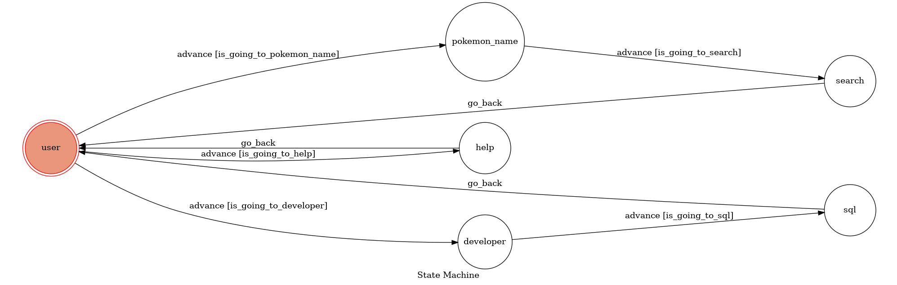

# Linebot2021
## Pokémon Library
This is a line bot written by Jansansnss

Database: Postgresgl

Deploy on: Heroku

(Supports multi-users)

### Finite State Machine

### Stage information
#### - user
* initial state that every user will enter at firt and every time after a sequential of operations.
#### -pokemon_name
* users may input the characters' name here and get the result in the next state.
#### - search
* show the detail information of which the user searched for, including "Name", "Type1", "Type2", "Total" , "HP", "Attack", "Defense", "Sp_Atk", "Sp_Def", "Speed", "Generation", and "Legendary".
#### - help
* help center shows the instruction to the users if they forget the key word for entering the state.
#### - developer
* only the developer has the permission to enter this stage because the following operation in the next state might be harmful to the database.
#### - sql
* this is where the developer(I or whoever gets the permission) is able to maintain the database without lots of complicated formalities, just simply type sql program instructions.

#### contact the author for more detail:
jansansnss@gmail.com